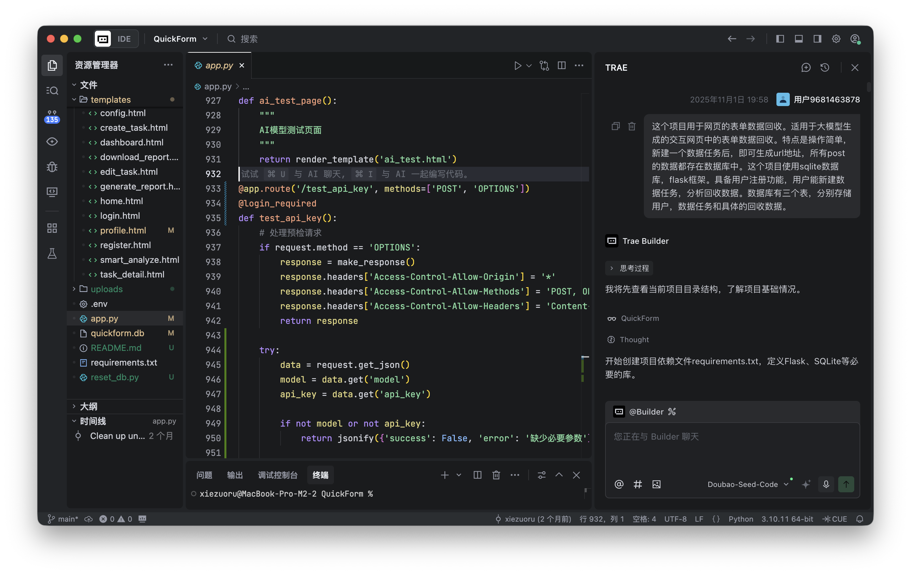

# QuickForm的故事

QuickForm自2025年11月诞生，其实关于它的思考早在一年前就开始了。

## QuickForm的开发背景

如今，即使没有编程基础的教师，也能通过大模型快速生成精美的交互式课件。无论是课堂点名工具、单词连连看，还是物理实验模拟页面，AI只需一句提示词，就能生成功能完整、界面美观的交互网页。这些页面甚至可以嵌入PPT中，让教学展示更具动态感和参与感。人人都会编程的时代正在到来！

然而，这类由AI生成的交互网页普遍存在一个痛点：它们虽然是“活”的，数据却是“死”的。学生在前端的每一次点击、每一个选择、每一段操作时间，这些有价值的数据都停留在本地，无法自动汇聚到教师手中。每个交互网页就像一个孤立的“数据孤岛”，教师难以了解学生的真实使用情况，也无法开展有效的教学分析与优化。要实现数据回收，通常要求教师具备后端开发能力，自行搭建服务器和数据库，这对大多数一线教师而言门槛过高。因此，如何简单、高效地回收交互网页产生的数据，成为AI生成内容在教学应用中的主要瓶颈。

## 谢作如的思考：AI赋能编程才是核心

谢作如是一名很早就在思考AI和教育的一线教师。2025年之前，他的主要研究方向是青少年如何学习AI，即AI教育。2025年之后，他担任温州科技高级中学的AI科创中心主任，开始正式思考AI如何赋能教师。

“如果说，前二十年的教育信息化培训，教师最后剩下的能力是制作PPT，那么AI时代的教师，最终需要培养哪方面的能力？是豆包吗？”这是私下流传在教育技术圈的严肃问题。他认为如果把核心能力定位在“豆包”“deepseek”之类，未免太泛。类似把计算机能力等同于某个操作系统。生成式AI给老师们带来的应该不仅仅是知识答疑、快速备课之类，而应该是编程。

2024年底，deepseek发布。一夜之间，很多教师开始在视频号上发布用deepseek写的“课堂点名工具”“倒计时”“单词连连看”等交互网页。教师编写交互网页和氛围编程一样，成为热点。2025年初，谢作如在《中国信息技术教育》杂志上发表了《借助大模型设计交互式课件》，初步表达了自己的思考：

当技术门槛消失，教师在AI赋能的过程中可以回归教育本质，关注教育自身。编程本是人与计算机的沟通语言，掌握编程相当于多了一种表达能力。当然除了网页这一类型外，老师们还有更多的选择，比如使用数学动画神器Manim，使用Python、Processing等。在教师培训中，我们不止一次地听到老师们在感慨："这就像有个听话的程序员住在电脑里。"或许这就是AI赋能教育的终极形态——没有炫技，只有恰到好处的融入。当每个教学灵感都能瞬间转化为数字现实，教育创新的火花必将绽放出前所未有的光芒，这也标志着教育技术开发模式从专业编程向需求描述的重要范式转变，人人都会编程的时代即将到来。

谢作如是早期的网站开发方面的工程师，或者叫做网页设计师或者网站开发工程师。2000年左右，还没有前端和后端的说法，流行的是动态网站开发。因为擅长开发动态网站，他从平阳调到温州中学。在温州中学的工作期间开发了各种教学系统，如选课系统、教学评价系统等。2013年研究创客教育后，才逐步停止了网站开发方面的工作。作为资深程序员，他一眼就看出AI编写的交互网页存在一个很大的弊端，那就是仅仅是静态网页！不是说AI无法写出动态网页，只是动态网页需要服务器环境，普通老师做不到。即使“单词连连看”再好玩，我们也没有办法知道哪些人在玩这个程序，哪些单词的错误率比较高。

要让静态网页的数据“活”起来，需要一个简单好用的数据服务。从2024年底到2025年，谢作如一直期望能找到一家教育企业，说法他们开发一个能解决这些生成网页的数据“流通”问题，没有成功。最后一次在北京，一位教育信息化方面的领导建议他：要不，先做一个Demo出来吧。

11月1日那天，刚好是一个周六。谢作如看着电脑中新安装的Trae（字节跳动旗下的编程工具），忽生一念：为什么不自己通过AI写一个这样的工具呢？于是，他在Trae的对话框中敲下这样的文字：

这个项目用于网页的表单数据回收。适用于大模型生成的交互网页中的表单数据回收。特点是操作简单，新建一个数据任务后，即可生成url地址，所有post的数据都存在数据库中。这个项目使用sqlite数据库，flask框架。具备用户注册功能，用户能新建数据任务，分析回收数据。数据库有三个表，分别存储用户，数据任务和具体的回收数据。

## QuickForm源自团队间的默契和信任

QuickForm的原型做好后，谢作如分别联系了方建文（温州大学）和林淼焱（温州科技高级中学），说我们做个有趣的项目吧，这个项目除了技术外，还需要学术支持，需要温州大学教育技术系的力量。方建文听了对项目的功能描述后问，技术支持来自哪里？他问的是哪个企业来提供技术支持。谢作如说，AI+林淼焱和AI+谢作如，够不够？

方建文和林淼焱是师生关系。实际上方建文的很多学生，也是谢作如的学生。QuickForm的顺利推进，源自团队间的默契和信任，还有价值观的一致。从以下细节可以看出：

- 通话后的第二天，林淼焱就把QuickForm部署到互联网上测试了。一周后，QuickForm正式开始公测。

- 提议QuickForm要开放，让大家用。那就开放吧。

- 提议QuickForm要开源，让老师们自己更新、维护。那就开源吧。

- 提议Quick应该分为不同版本，面向不同需求，即使不开源的版本也应该免费，那就免费吧。

- ……

QuickForm发布后，谢作如在公众号上写了一篇文章，然后转发在朋友圈上。就这么简单，一个月内注册用户接近1000。用户基本上是老师，来自全国各地。知道QuickForm会很受欢迎，没想到怎么受欢迎。

文章链接：[QuickForm：让大模型生成的交互网页也能回收数据](https://mp.weixin.qq.com/s/ouhSP_UHLfDbQMO2Ch_bkQ)

## QuickForm是一个AI原生项目

有人问，“QuickForm”这个名字挺好的，其实就是Trae取的。开发QuickForm花了多少时间？对原型编写来说就花了两天。如果不是对Trae不熟悉，走了些弯路，一天时间足够了。在维护QuickForm的过程中，我们“手搓”过代码吗？没有。

要解决AI编程带来的新问题，用AI编写了一个新工具。用AI采集到的数据无法用传统方式分析，那就再借助AI进行分析。每一个环节和AI有关。这样的应用不再是传统的“AI+”，而属于“AI原生应用”。

QuickForm适合解决哪些问题？其实对数据安全不高的工作，都可以使用。

## 故事还没有结束

现在，QuickForm已经分为教师版和校园版两个版本。教师版开源，特点是单用户，适用老师们装在自己的电脑上，面向班级学生，在局域网内回收数据。我们特意内置了Python环境，做成绿色软件，解压后一键启动。

校园版不开源，但是签署合作协议后可以免费。为什么不开源？因为在互联网上部署的就是这个版本，担心有安全隐患。为什么要签署协议？为了找到志同道合的朋友，我们追求开源分享，希望你也一样。

QuickForm的故事还在继续，欢迎您的加入。

