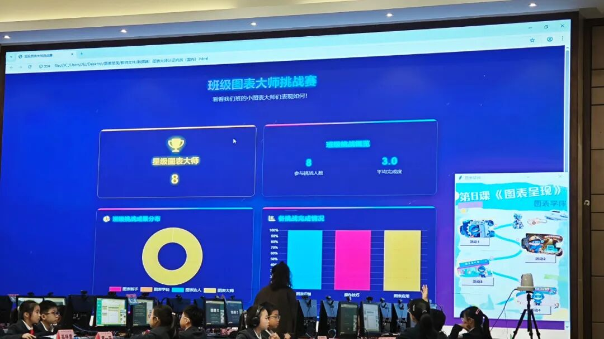
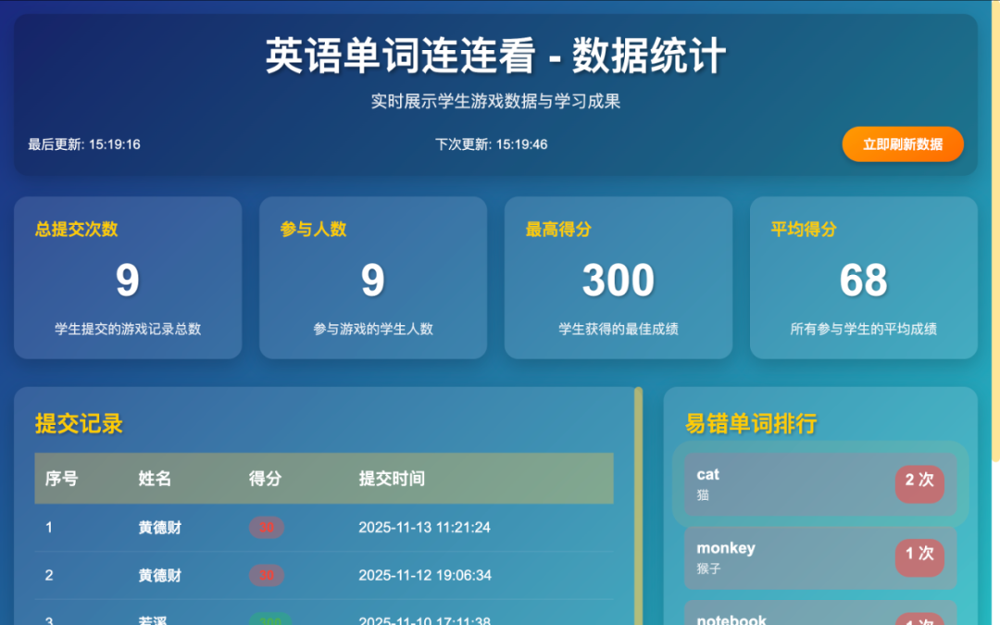
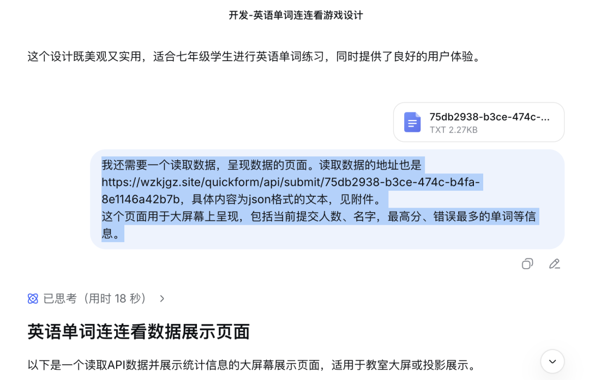
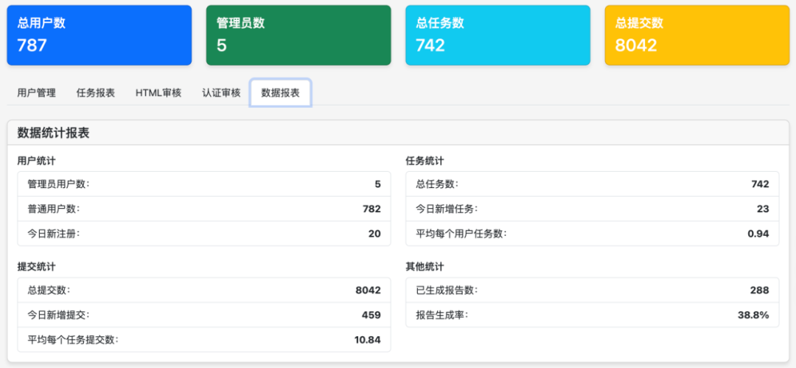

# 常规课堂数据收集

例如：课前，快速生成调查表，了解学生的前置知识或兴趣倾向；课中，借助学习终端实时收集学生对讲解内容的理解程度；课后，生成随堂小测验，即时查看答题情况与正确率。

## 案例1：

## 案例2：

## 案例3：

## 案例4：为回收数据编写实时展示大屏

**作者**: 谢作如  
**发布时间**: 2025-12-05  
**原文链接**: https://mp.weixin.qq.com/s/KQzyEy7q5-Z-OO43LOgXwA

---

平阳的谢贤晓老师发来需求，问QuickForm是否支持数据大屏。一开始没理解数据大屏是什么，直到她发来一张图。

原来是这个！我说早就支持啦，只是方建文博士的团队还没来得及把示例的教程写出来而已。之前也是群里的老师（貌似来自四川的彭老师）提出需求，说希望用POST方式写入数据，GET方式读取数据。所以，直接在浏览器上访问WebAPI（就是提供的URL地址），就能看到所有的数据。

我打开deepseek，翻出自己之前做的"英语连连看"网页，增加如下提示词：

> 我还需要一个读取数据、呈现数据的页面。读取数据的地址也是https://wzkjgz.site/quickform/api/submit/75db2938-b3ce-474c-b4fa-8e1146a42b7b，具体内容为json格式的文本，见附件。这个页面用于大屏幕上呈现，包括当前提交人数、名字，最高分、错误最多的单词等信息。

提示词中的附件，来自访问"https://wzkjgz.site/quickform/api/submit/75db2938-b3ce-474c-b4fa-8e1146a42b7b"得到的数据，另存为文本文件就行了。从图中可以看出，效果还是挺好的，大模型的编程能力让人惊叹。

我们会发现，QuickForm提供是一个快速数据接口，如何利用这个接口则看老师们的创意了。只要敢想，没有什么是做不到的。当然，如果要实现更多功能，则需要了解更多关于交互网页的知识。我们准备设计几个公益讲座，介绍交互网页的开发知识。

顺便给大家看一下用户数量，挺让我们激动的。

**后续**

我和林淼焱商量了一下，觉得GET方式返回所有数据，对服务器的压力会比较大。老师在操作的时候容易误操作。我们继续修改代码，调整功能，具体如下：

- 默认返回最新的三条数据，如：
  - `https://wzkjgz.site/quickform/api/submit/UwwZESikX34`

- 需要返回全部数据，则访问新地址，如：
  - `https://wzkjgz.site/quickform/api/submit/UwwZESikX34/all`

---

*本文档由AI助手整理自微信公众号文章*