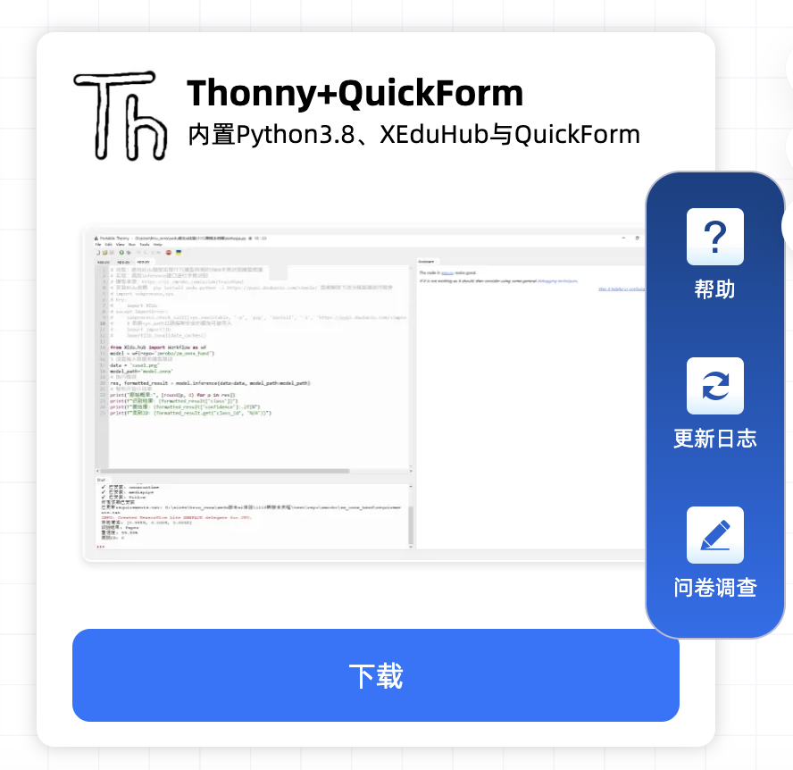
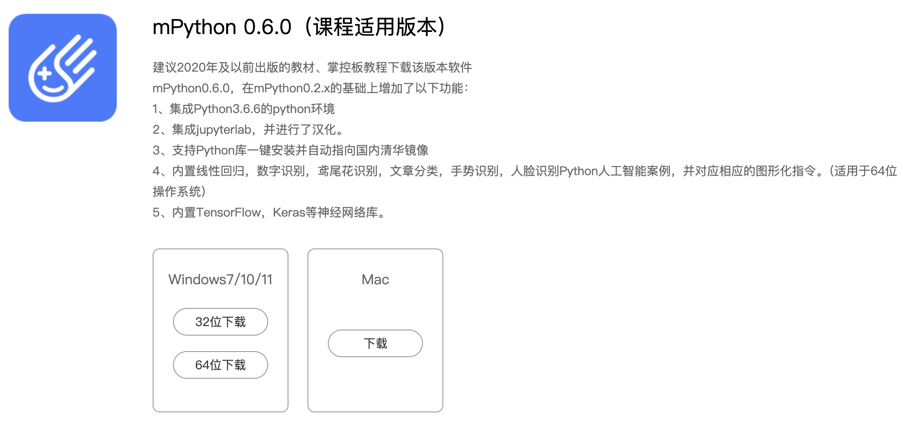

# 玩转：本地部署QuickForm

QuickForm是一个轻量级表单数据回收系统，专门为大模型生成的交互网页而设计。在大模型生成网页的同时，嵌入专用的数据地址后即可实现数据收集，进而实现数据分析、可视化呈现、报告生成。QuickForm采用了无加密形式的API数据接口，兼容绝大多数的大模型生成的代码，成功率特别高。

为了让更多教师最快速度用上QuickForm，体验AI赋能教学带来的各种便利，我们购买了云服务器，申请了域名，部署了线上的版本（演示地址：[https://quickform.cn](https://quickform.cn)），老师们现在注册后就能使用。

## 1.本地部署QuickForm的理由

虽然有了[https://quickform.cn](https://quickform.cn)这个网站，我们依然期望有更多的老师能在本地部署QuickForm。理由很多，主要有以下几条：

1）来自海量访问的担忧。因为限于财力和能力，我们无法保证这个线上的QuickForm能服务很多教师。当用户一多，也许网站访问速度就会很慢，轻则影响体验，重则无法正常提供服务。因此我们期望老师们能部署自己的QuickForm，确保可以稳定、正常地使用。

2）来自学校规模的需求。有些学校的规模较大，而且在全校层面开展AI赋能教学，不仅仅信息科技一个学科。那么就很有必要自己部署一个QuickForm，就跟我校一样，以教研组为单位，不仅能确保服务稳定，还能促进内部交流。

3）来自网络环境的制约。有些学校可能平时上课的地方（机房）不能上公网。有些老师在陌生的环境临时上课，尤其是公开课，就很有必要在自己的电脑部署一个专属QuickForm。比如我的电脑就安装了一个，专供自己使用。

## 2.QuickForm的本地部署

我们把QuickForm分为在线版、校园版和教师版。本地部署的QuickForm，指的的是校园版和教师版。其中，QuickForm教师版开源，校园版免费提供给项目合作的单位（学校）。

QuickForm采用Python语言编写，支持多操作系统，能快速部署到自己的电脑上，学校的服务器上，然后在局域网中使用。当然，也可以像我们一样，购买云服务器，在公网上使用。

QuickForm文档地址：[https://quickform.readthedocs.io/](https://quickform.readthedocs.io/)

QuickForm开源仓库：[https://gitee.com/wstlab/quickform](https://gitee.com/wstlab/quickform)

QuickForm开源仓库：[https://github.com/wstlab/quickform](https://github.com/wstlab/quickform)

### 2.1 部署QuickForm教师版

QuickForm教师版是一个开源软件，适用于每一位教师。老师们只要将QuickForm解压到本地电脑，然后运行bat文件即可，支持Windows、Linux、MacOS等系统。

<!-- mp4格式 -->
<video id="video" controls="" preload="none" poster="封面">
      <source id="mp4" src="../images/guide/QuickForm_t_deploy.mp4" type="video/mp4">
</videos>

访问QuickForm的开源仓库，即可在“teacher（教师版）”中找到下载链接。

下载地址1：[https://gitee.com/wstlab/quickform/](https://gitee.com/wstlab/quickform/)

下载地址2：[https://github.com/wstlab/quickform/](https://github.com/wstlab/quickform/)

对于动手能力较强，或者有编程技术的老师，推荐下载“纯代码”版，根据readme文件中的介绍，把库装好，运行“app.py”文件即可。也可以下载“一键安装包”或者“一键运行”版本。这些版本已经内置了Python，直接运行“QuickForm启动器.bat“即可。

启动QuickForm后，你的电脑就成为一台Web服务器，通过局域网地址即可访问。当然，你也可以通过一些网络软件，将本地端口映射到公网上。或者可以申请一个云服务器部署，但前提是要确保安全。

**注意：更多安装QuickForm的方法**

还有很多简单的方式使用Quickfom，如下载中鸣版Thonny、mPython之类内置QuickForm的Python编辑器。

1）中鸣版Thonny：内置QuickForm

中鸣版Thonny，内置了Python3.8、XEduHub与QuickForm。

地址：[https://ai.zmrobo.com/libs](https://ai.zmrobo.com/libs)

2）mPython：in7以下版本也能安装QuickForm

QuickForm“一键安装包”内置的是Python3.8，在Win7中不能运行。其实你只要安装Python3.7之前的版本，如3.65之类，就能流畅运行QuickForm教师版。当然，你也可以安装mPython的32位版本（mPython 0.6.0），然后打开并运行QuickForm存代码版的“app.py”文件。

地址：[https://mpython.cn/software](https://mpython.cn/software)

盛思之后推出的mPython，将内置QuickForm。

### 2.2 部署QuickForm校园版

QuickForm校园版是一个免费软件，仅面向项目成员开源。和教师版对比，校园版支持多用户，支持群组和交流功能，适合部署在校园内，供所有教师使用。

要获得QuickForm校园版，首先需要与项目组签署一个合作协议。合作协议的核心内容为能定期提供优秀案例分享给更多老师。我们期望能找到志同道合的朋友。

合作介绍：[https://mp.weixin.qq.com/s/JIJSxCsL-ImGNuS2UnoAZg](https://mp.weixin.qq.com/s/JIJSxCsL-ImGNuS2UnoAZg)

协议内容：QuickForm校园版合作协议（第2版）

如果你有意向加入项目组，请先填写一个简单的问卷。我们将在2026年节后的开学初启动签约工作。

想加入QuickForm项目的意向表：[https://wj.qq.com/s2/25715865/17b8/](https://wj.qq.com/s2/25715865/17b8/)

## 3.关于QuickForm的风险提示

因为QuickForm采用了无加密形式，只能适用于对安全不敏感的，临时性的教学数据采集工作，如课前调查，课中反馈，课后检测等。无论是使用线上的QuickForm.cn服务还是本地部署Quickform，都不建议使用QuickForm收集敏感数据，容易造成数据泄密。

