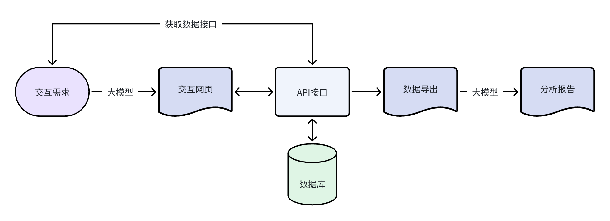

# 原理：QuickForm的工作流程

在第一次接触网页制作的老师眼里，QuickForm是一个神奇的网站。大模型生成的网页嵌入QuickForm的数据地址后，数据就很神奇的汇聚起来。实际上，数据回收本来就是网页的基本能力。

## QuickForm的工作原理

任何网页要实现数据传递，一般都通过表单（From）技术。顾名思义，表单就是网页上的表格，注册用户、登录网站等操作，都要先填写一些信息。那些文本框、单选框、多选框、下拉菜单等，都属于表单中的各种控件。每个表单都有一个“action”属性，表示表单提交到哪个地址。这个地址可以是网页自身，也可以是其他网页。

QuickForm的原理是提供了一个写入和读出的数据接口（WebAPI），将任何提交过来的数据分类保存在数据库中。因为每一个数据任务的地址都是不同的，有独特的标识，所以不会混淆。其工作流程如下：

因此，我们可以把Quickform提供的WebAPI地址看成是一个云盘（U盘），可以随时写入数据，也可以读出。只要我们对大模型说：“……请将网页的数据以POST形式提交到……”实际上就告诉大模型，这个网页要用表单技术来提交数据，表单的“action”属性地址就是提供的URL，数据提交方式（method）是POST。因为表单技术很成熟，大模型都能理解，所以基本上所有大模型都能正确生成网页。

## QuickForm的设计理念

很多人会认为表单的数据要按照一定的规范设计，不然就不好保存，也不好后续做分析。的确，传统的表单数据是精确定义了字段数量和类型，然后借助SQL语言进行分析。

QuickForm的设计理念是“用AI解决AI的问题”，即用借助大模型来分析收集到各种数据。也就是说，即使提交到QuickForm的数据缺少规范，看起来是凌乱的，但是在大模型的强大能力支持下，依然可以很好的做分析统计。事实证明，QuickForm的设计是合理的，用户不需要了解数据类型之类的专业知识，不用关心数据格式和SQL，只要能描述要求，能正确回收数据，大模型就能帮你做好后续的分析工作。

“用AI解决AI的问题”，实际上继承了图灵的思想，就是“用机器打败机器”。因此如果想得到更好的效果，你可以下载数据后，直接和大模型对话，以得到更加精细化、个性化的分析。

## QuickForm的能力边界

QuickForm提供的API不仅可以写入（POST方式），还可以读出（GET方式），因此可以做多种交互网页，如表单提交、实时统计等。而这些都通过同一个地址就能实现，降低了难度，又不牺牲其灵活性。

经典应用：将数据用POST方式提交到QuickForm。如问卷回收，在线考试等。

交互分析：用网页1提交数据，再做一个网页2读取数据实时分析。如数据看板、数据驾驶舱、数据大屏等。

即时互动：在一个网页上边提交数据，边读取数据。如聊天室、留言本等。

我们还会设计更加复杂的交互功能，如更新。请期待后续功能的更新。

**但是，我们千万要记住，QuickForm在追求便捷的时候，牺牲了数据的安全性。你不能用QuickForm去记录具备保密性质的敏感数据。如果你因为误用QuickForm而造成数据泄密，我们可不承担责任哦。**

## 浏览器推荐

实际上，在任何编程语言中，网页语言（HTML）的兼容性是做得最好的。考虑到兼容性，我们推荐使用谷歌浏览器。

