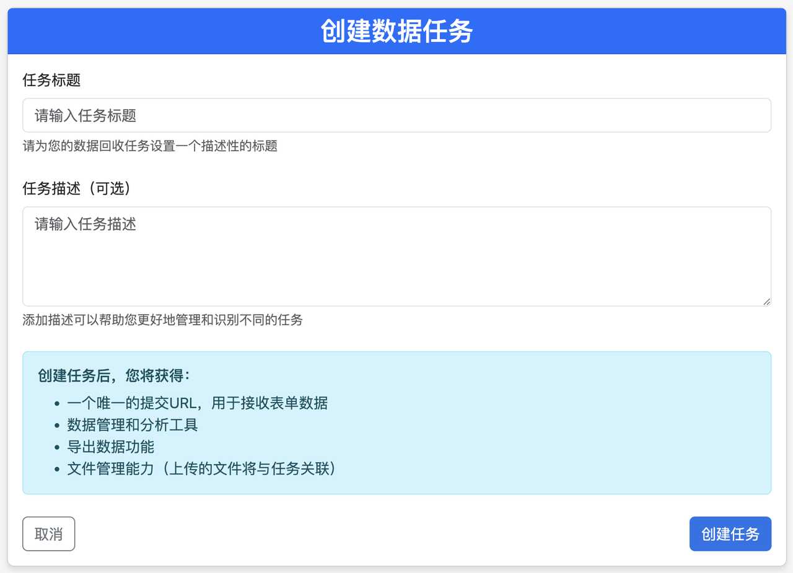
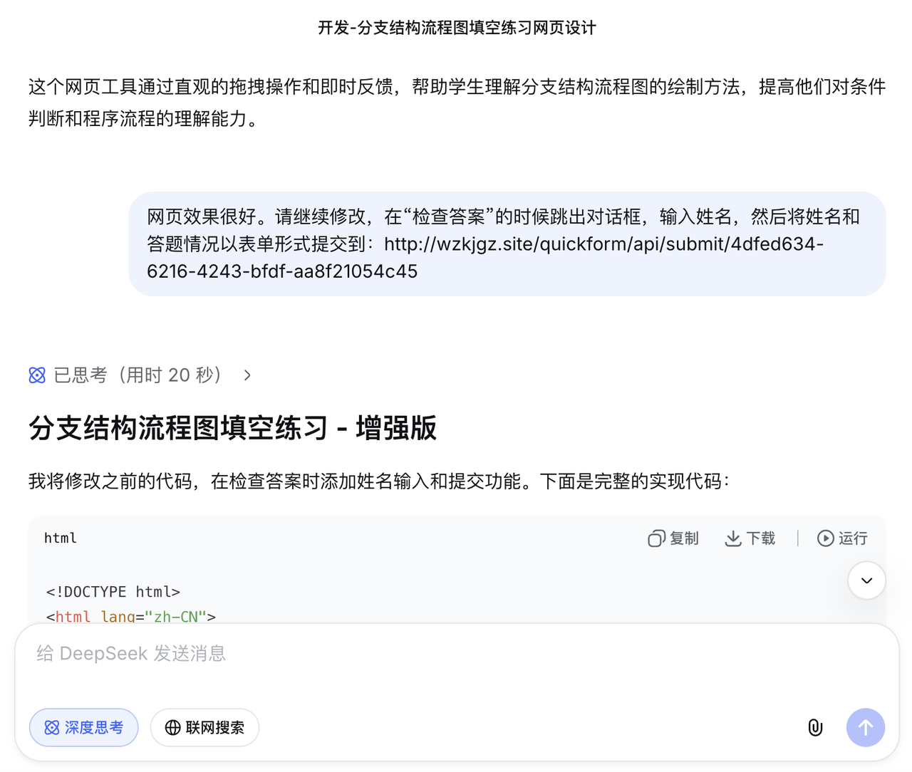
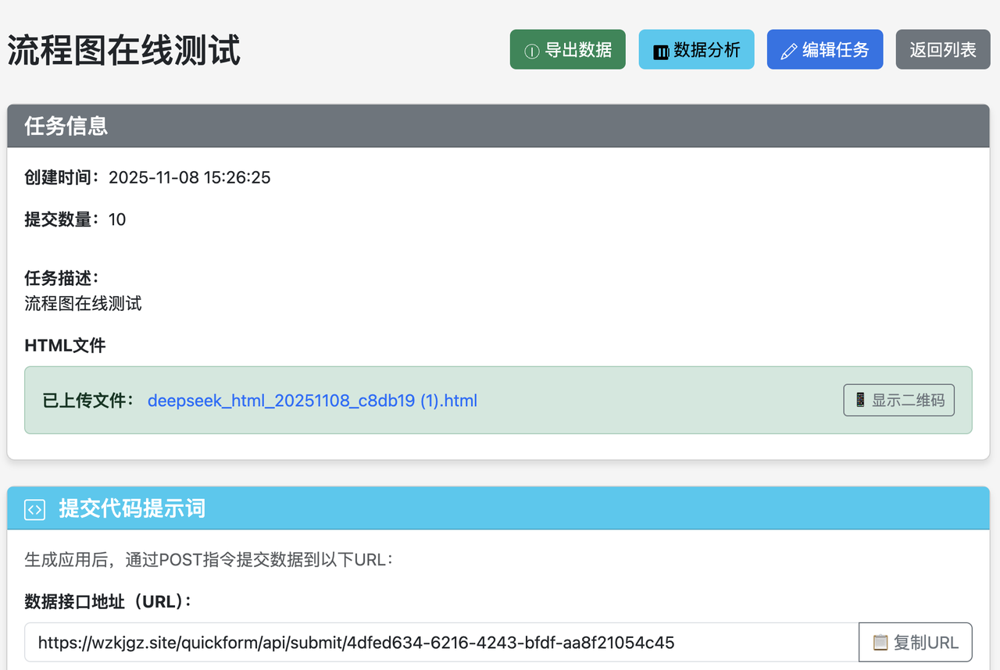
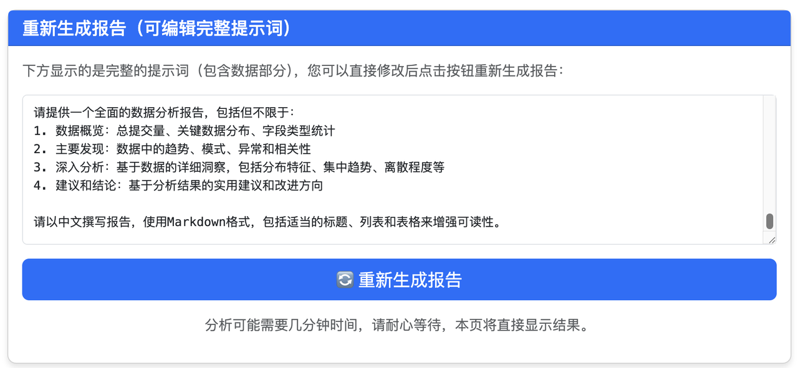

# 入门：四步体验QuickForm

只要你用大模型（deepseek、豆包之类）制作过交互网页，就具备使用QuickForm的基础。QuickForm本身不具备生成交互网页的能力，但提供了数据接口，能够把网页数据汇总起来。

使用 QuickForm 收集交互网页数据非常简单，只需以下四步。

## 第一步：生成表单地址

访问 QuickForm 平台（演示地址：[https://quickform.cn](https://quickform.cn)），注册账号后，在“数据任务”页面中点击“创建新任务”，系统将自动生成一个专属的API接口地址。该地址如同您的“数字收件箱”，所有学生提交的数据都会汇集于此。

## 第二步：生成交互网页

继续使用您熟悉的大模型（如 DeepSeek、GPT 等）生成交互网页，只需在提示词中加入一句：
“请将数据以表单形式提交至（您的 QuickForm 数据接口地址）。”

大模型会自动在网页中嵌入数据提交功能。学生完成操作后，数据将通过接口自动存储至您的 QuickForm 账户。

## 第三步：收集与查看数据

学生使用交互网页并提交数据后，您可以在 QuickForm 任务界面实时查看所有提交记录。系统支持逐条查看详情，也支持批量导出为 Excel 表格，便于后续统计与存档。

## 第四步：生成智能报告

若数据量较大、手动分析困难，QuickForm 支持一键生成智能分析报告。系统可调用大模型对数据进行初步分析，生成包含提交人数、平均分、错误分布、高频问题等内容的可视化报告，帮助教师快速把握教学重点与难点。您也可导出数据，结合更精确的提示词进行深入分析。

注意：要一键生成智能分析报告，首先得有大模型的APIKEY（API密钥）。具体请参考“大模型服务API密钥获取”。

最后，看一个简单的介绍视频吧。

<iframe src="//player.bilibili.com/player.html?isOutside=true&aid=116215053812928&bvid=BV1hsc6zHEoN&cid=36643342242&p=1" scrolling="no" border="0" frameborder="no" framespacing="0" allowfullscreen="true"></iframe>

