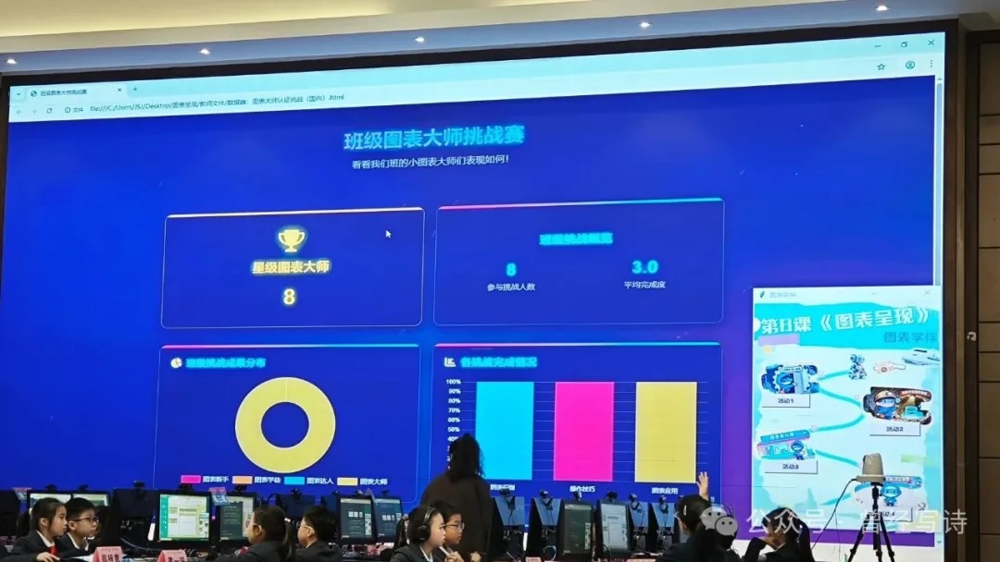
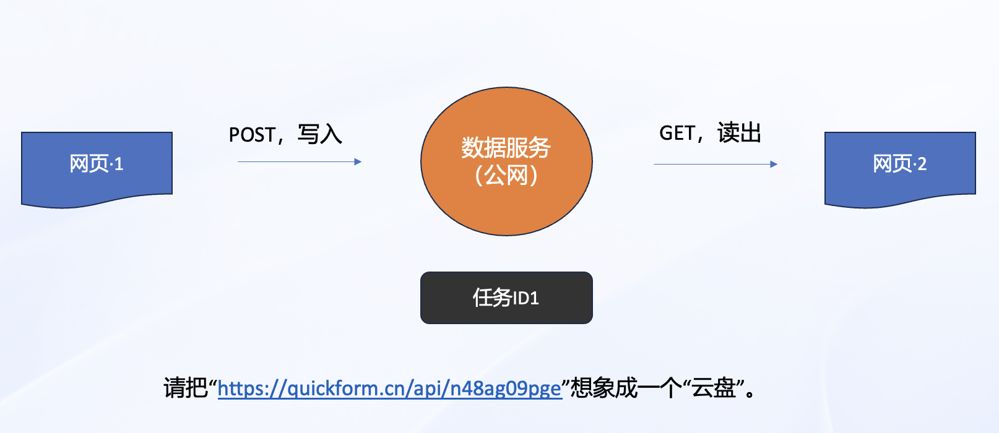
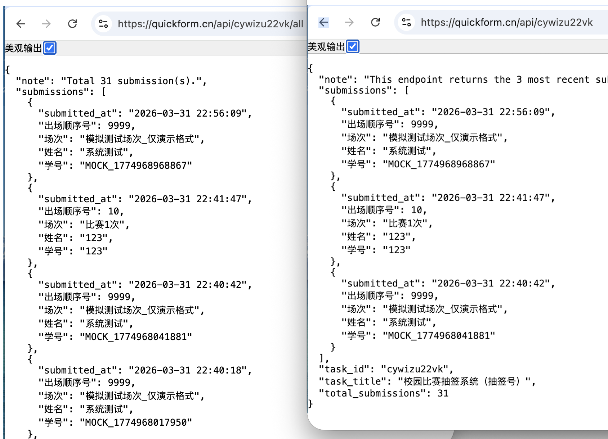
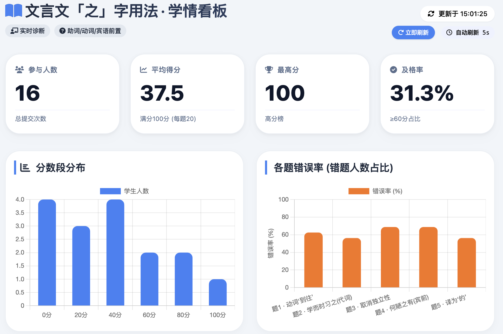
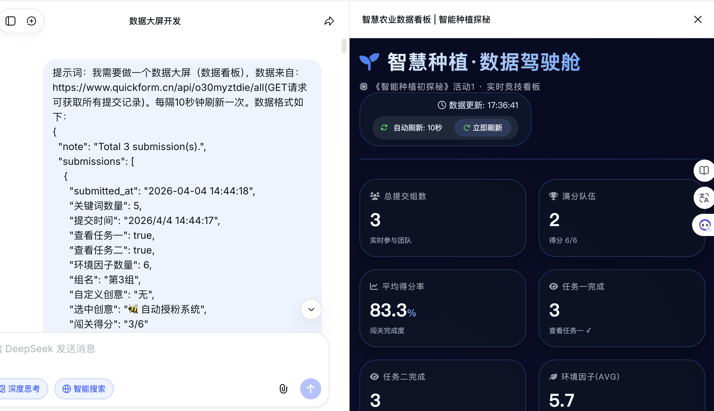

# 进阶：实现即时交互的数据大屏

很多老师因为看到炫酷的数据大屏效果，而被大模型+QuickForm的能力深深打动。实际上Quickform测试版发布不久后，就能支持数据双向流动的能力，具备了编写数据大屏的技术基础。

## 什么是数据大屏

数据大屏也称“数据看板”（dashboard）。在企业数字化场景中，通常指通过可视化方式将关键业务指标、数据趋势、运营状况等信息集成展示于单一界面的大屏系统。课堂教学中，使用数据大屏可以实时了解学生的学习情况，一目了然，的确很受欢迎。

顺便说一下，关于数据大屏的需求是平阳的谢贤晓老师最早提出。下面是她在听一节课公开课时拍的照片。



## QuickForm原理解析

Quickform支持使用同一个数据任务的API地址进行读写操作，即用POST方式写入数据，GET方式读取数据。我们可以把Quickform看成是一个数据U盘、云盘。



需要说明的是，在数据读写方面校园版和教师版略有不同。对于教师版来说，直接在浏览器上访问数据任务的WebAPI（就是提供的URL地址，https://quickform.cn/api/kpgugxdskx），就能看到所有的数据。但是，校园版（在线版本）只返回最新3条数据，需要增加“/all”，如https://quickform.cn/api/kpgugxdskx/all，这样才能返回所有数据。



## 数据大屏的编写

跟大模型制作交互网页一样，数据大屏的编写也很简单。最简单的做法是：

> 提示词：我需要做一个数据大屏（数据看板），数据来自：https://quickform.cn/api/kpgugxdskx/all(GET请求可获取所有提交记录)。每隔10秒钟刷新一次。

一般来说，大模型会自动访问“https://quickform.cn/api/kpgugxdskx/all”，然后解析数据格式，设计数据看板。对于提示词，有很多种写法，你也可以这样：

> 提示词：我需要做一个数据大屏（数据看板），数据来自：https://quickform.cn/api/kpgugxdskx/all。每隔10秒钟刷新一次。

或者，这样也行。

> 提示词：我需要做一个类似数据大屏（数据看板）的网页，数据来自：https://quickform.cn/api/kpgugxdskx/all。每隔10秒钟刷新一次。



我们可以把能编程的大模型分成几类。一类是内置技能，可以自己去访问网址的，比如扣子编程。一类是不具备访问网址能力，如deepseek（很奇怪，有时候deepseek也是能自己去访问网站的）。

对于扣子编程之类，能自己去访问网址的，使用“简洁版提示词”，如：

> 提示词：我需要做一个数据大屏（数据看板），数据来自：https://www.quickform.cn/api/o30myztdie/all(GET请求可获取所有提交记录)。每隔10秒钟刷新一次。



对于deepseek之类，不能自己去访问网址的，使用“完整版提示词”，如：

> 提示词：我需要做一个数据大屏（数据看板），数据来自：https://www.quickform.cn/api/o30myztdie/all(GET请求可获取所有提交记录)。每隔10秒钟刷新一次。数据格式如下：
> {
>   "note": "Total 1 submission(s).",
>   "submissions": [
>     {
>       "submitted_at": "2026-04-04 14:44:18",
>       "关键词数量": 5,
>       "提交时间": "2026/4/4 14:44:17",
>       "查看任务一": true,
>       "查看任务二": true,
>       "环境因子数量": 6,
>       "组名": "第3组",
>       "自定义创意": "无",
>       "选中创意": "🐝 自动授粉系统",
>       "闯关得分": "3/6"
>     }
>   ],
>   "task_id": "o30myztdie",
>   "task_title": "《智能种植初探秘》活动1",
>   "total_submissions": 1
> }


实际上，老师们编写数据大屏也常常会遇到问题。但只要记住两个两个关键即可：

1.打开“深度思考”

最好打开大模型的“深度思考”功能，让大模型有足够的时间分析数据格式，写出准确的代码。

2.提供数据样例。

如果大模型反馈无法读取api地址之类（看“思考”输出的内容），这时候生成的代码肯定不能用，大概率是模拟的。你就提供访问API地址，如“https://quickform.cn/api/kpgugxdskx/all”。将里面的文本复制出来给大模型看，也就是使用完整版的提示词。你可以重新提问，也可以追问：

> “https://quickform.cn/api/kpgugxdskx/all”的数据格式如下……
> 继续修改。

你也可以保存为txt文件，作为附件补充。因为网页提交的数据和获得的数据格式并不一样，大模型无法脑补数据长什么样子。你如果不提供，能力再大的大模型也做不到。

**这个方法同样适用于本地部署的教师版，即给出网址的同时，提供样例数据。**

3.提供数据说明。

有些交互网页提交的数据很抽象，只有数字，或者ABCD之类的字母，不知道表示什么意思。如果想做出来的数据大屏有意义，必须要说明这些数据代表什么。简单的办法是，将交互网页作为附件发给大模型，或者在制作交互网页的对话中继续提需求。参考提示词如下：

> 我做了一个交互网页（student.html），收集了相关的数据。通过访问地址“https://192.168.31.53/api/kpgugxdskx”就能获取全部数据，数据的格式如下……。请设计一个数据大屏，每隔10秒钟刷新一次。


## 问题排查

如果遇到各种问题，也不用担心，肯定能找到解决方案。

1.可能是js文件没有正常加载。因为大模型生成的数据大屏页面，需要js代码的支持，这些js代码的地址往往在国外网站。我们多次发现电信的网站不能访问的概率最大。可以请大模型使用国内的地址，提示词如“请使用国内的js文件地址”。

2.可能是大模型的理解错误。我们发现deepseek特别会“胡思乱想”，“API地址”最好不要说成“服务器”，不然容易出错。

3.可能是QuickForm的流量限制。因为频繁读取会极大影响服务器的性能，QuickForm在线版限制了一定时间内的读写频率。请记着写上“每隔10秒钟刷新一次”。在数据任务详情处可以看到具体的接口访问统计。

## 其他说明

1.为什么在线版和教师版的获取数据API不一致？

的确，在线版和校园版都需要加上“/all”才能看到所有数据，否则仅仅返回3条。但是，教师版不管是否加“/all”都返回全部数据。

为什么要这样设计？其实就是为了省流量。我们担心老师们对API不熟悉，给大模型写指令的时候，万一忘了提醒“每隔多少时间刷新一次”，就是造成服务器不断刷新。不仅服务器性能受影响，也会浪费流量。所以直接在浏览器上访问数据任务的WebAPI，校园版返回的是最新3条数据。

2.数据格式详解

我们设计的数据格式非常简单，以JSON（JavaScript Object Notation，一种轻量级的数据交换格式）作为交换格式。返回一个对象，有“note”、“submissions”、“task_id”、“task_title”、“total_submissions”等5个字段。其中“submissions”的值为数组，数组内单条记录的值为对象，每一个对象，就是每一次提交收集的数据包。

```json

{
  "note": "提示",
  "submissions": [
    {记录1},
    {记录2}
  ],
  "task_id": "任务的API值",
  "task_title": "任务名称",
  "total_submissions": 记录数量，如2
}

```

以下面一个科学调查的数据任务为例。

```json

{
  "note": "This endpoint returns the 3 most recent submissions. Full list: https://quickform.cn/api/sg826h31vv/all",
  "submissions": [
    {
      "age": 49,
      "consent": "同意",
      "gender": "女",
      "health_status": "健康，无不适",
      "measurement_date": "2026-04-06",
      "measurement_site": "口腔",
      "measurement_site_raw": "口腔",
      "measurement_time": "11:08",
      "pre_activities": [
        "无"
      ],
      "resting_confirmation": "是",
      "submitted_at": "2026-04-06 11:09:01",
      "temperature_celsius": 37.4
    },
    {
      "age": 51,
      "consent": "同意",
      "gender": "男",
      "health_status": "健康，无不适",
      "measurement_date": "2026-04-02",
      "measurement_site": "腋下",
      "measurement_site_raw": "腋下",
      "measurement_time": "22:46",
      "pre_activities": [
        "无"
      ],
      "resting_confirmation": "是",
      "submitted_at": "2026-04-02 22:50:21",
      "temperature_celsius": 36.4
    }
  ],
  "task_id": "sg826h31vv",
  "task_title": "科学调查（体温）",
  "total_submissions": 2
}

```


